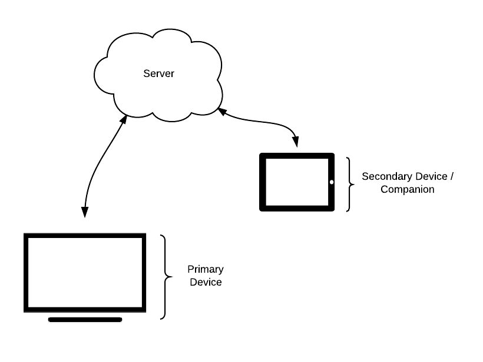
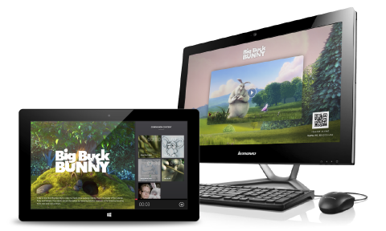

# How to Build Second Screen Web App
A second screen application "is an application primarily created to enrich the viewing experience on the First Screen"[[1](http://en.wikipedia.org/wiki/Second_screen)], a common example of this can be seen with Microsoft’s [SmartGlass](http://www.xbox.com/en-US/smartglass) technology. Typically theses experiences rely on native apps to communicate between devices, which limit developers to specific platforms, and in-turn limit the audience developers can reach.

A second screen *web app* uses modern web technologies to deliver a similar experience without the dependency of writing native code. In this post we explore how to create a simple second screen or companion experience.
						
The complete source for this post can be found here [inset link]. The Primary experience in our web app will play the short film [Big Buck Bunny](http://www.bigbuckbunny.org/index.php/about/index.php), while the Secondary experience will allow for play/pause functionality, as well as the ability to seek forward and backward in the video based on companion content. To view a live demo click here [insert link]. 

## The Basics
From a high level, we are trying get two devices to communicate with each other in near real-time. With current web technologies, this is achieved without direct communication between primary and secondary devices. In the future direct communication may be possible with WebRTC or similar standards, so keep your eyes open for developments in that space. Figure 1. illustrates the basic architecture of the system we will be building. The Server will be responsible for most of the work, it will be serving static html, fonts, javascript, images, and other files along with marshaling communication between primary & secondary devices.

*Figure 1: High Level Architecture*

### Step One: Build A Simple Server
The server will serve assets to both primary and secondary devices. To do this we will use [Node](http://nodejs.org/) and a package called [Express](http://expressjs.com/). Express is a web application framework that sits on top of the HTTP Server provided by Node. Express provides a lot of convenience methods, and makes hosting static content very simple. The code snippet below brings up a web app on `port 8000` and hosts all of the content located in the `./public` directory. Download, unzip and follow the README.md within [step-1.zip](./step-1.zip) for a completed example.

    var http    = require("http"),
        express = require("express"),
        app     = express(),
        server  = http.createServer(app);
      
    // configuration
    var port    = 8000,
        pubdir  = "./public"; 

    app.configure(function() {
     // Set Public Directory
     app.use(express.static(pubdir));
    });

    // Start Server
    console.log("Starting Server on " + port);
    server.listen(port);
  
### Step Two: Add Pub/Sub Messaging
In step one we created a simple HTTP Server capable of hosting static content. In this step we will add the ability for our clients (Primary & Secondary devices) to send and receive messages. We will use [Faye](http://faye.jcoglan.com/) for this task. Faye is an implementation of the [Bayeux Protocol](http://svn.cometd.com/trunk/bayeux/bayeux.html) that provides transport layer abstractions, as well as easy to use client and server APIs. Transport layer abstraction basically means Faye will worry about the best transport mechanism to use for maximum cross browser support, weather it be WebSockets, Long-polling via HTTP POST Requests, Cross Origin Resource Sharing, or Callback-polling via JSON-P. To integrate faye all we need to do is create a bayeux server, configure a mount point and attach it to the existing HTTP Server.

    var http    = require("http"),
        express = require("express"),
        faye    = require('faye'),
        app     = express(),
        server  = http.createServer(app);
      
    // configuration
    var port         = 8000,
        pubdir       = "./public",
        fayeSettings = {
          "mount": "/channel",
          "timeout": 45
        };

    // Create Bayeux Server
    var bayeux = new faye.NodeAdapter(fayeSettings);
      
    app.configure(function() {
      // Set Public Directory
      app.use(express.static(pubdir));
    });
          
    // Start Servers
    console.log("Starting Bayeux Server at " + fayeSettings["mount"]);
    bayeux.attach(server);
    console.log("Starting Server on " + port);
    server.listen(port);

#### Adding Client Side Pub/Sub Messaging
To integrate faye on the client side we simply include a script tag that points to our mount point followed by "client.js” -  ``. To test basic communication a simple index.html was created with a hard coded channel `/test` . Download, unzip and follow the README.md within [step-2.zip](./step-2.zip) for a completed example.

    (function(faye){
      "use strict";
      var pre = document.getElementsByTagName("pre")[0],
      client = new faye.Client(window.location.origin + "/channel"),
      id = Math.random().toString(36).substr(2, 5),
      subscription = client.subscribe("/test", function(data) {
        if (data && data.id !== id) {
          if (pre) {
            pre.innerHTML = pre.innerHTML + "message: " + JSON.stringify(data.message) + "\n";
          }
        }
      });
      
      subscription.then(function() {
        // Create simple message to send
        if (pre) {
          pre.innerHTML = pre.innerHTML + "I am: " + id + "\n";
        }
        client.publish("/test", {id: id, message:"Hello! - from " + id });
      }, 
      function(err){
        if(console && console.log) {
          console.log(err);
        }
      }); 
    })(Faye);

### Step Three: Create RESTful API
The index.html from step two creates a hard coded channel `/test`. This would cause every client that navigated to our site to connect over the same communication channel, which will not work for our purposes. Moving forward we will need unique channels to be established between our primary device, and any secondary or companion devices we want to connect. To achieve this goal, we will create a RESTful API to relay channel information amongst devices, as well as serve different html when a secondary device establishes a connection. We will use a simple 3 letter code generated by the server. The unique code will also be stored in memory to validate secondary/companion devices attempting to connect. Download, unzip and follow the README.md within [step-3.zip](./step-3.zip) for a completed example.

###### POST /session
Posting to `/session` from a primary device will create a new session on the server and provide the information necessary to connect secondary devices. The handler for the request is below.

    // Respond to Session POST Request
    app.post('/session', function(req, res, next) {
      var token   = getToken(3).toUpperCase(),
          session = {
              channel: token,
              url: "//" + host + "/" + token,
              mount: "//" + host + fayeSettings.mount
            };
            
      sessions.push(session.channel);

      // Post Response
      res.status(201)
         .json(session)
         .end();
    });

###### GET /:channel
When a primary device creates a session, it creates a link that can then be used by secondary devices to connect. When a secondary/companion device requests a `GET` from `/:channel` , where `:channel` is the 3 letter channel token, the response will contain the html associated with the secondary experience, along with the configuration information to connect the two devices. The validation and request handling code is below.
  
    // Validate Session Channel
    app.param(":channel", function validateChannel(req, res, next, channel) {
      if(channel !== null && channel !== undefined && channel.length === 3 && sessions.indexOf(channel) > -1) {
        req.channel = channel.toUpperCase();
      }
      next();
    });

    // Respond to Secondary GET Request
    app.get('/:channel', function(req, res, next) {
      if(!req.channel) {
        res.sendfile(errorfile);
      } else {
        res.sendfile(companion);
      }
    });

### Putting It All Together
In steps 1 thru 3 we laid the foundation for our second screen web app. We created a server capable of serving static content, as well as marshaling communication between multiple devices. For this application we selected [Big Buck Bunny](http://www.bigbuckbunny.org/index.php/about/) content to showcase our second screen web experience, Figure 2 is a preview of the primary and secondary experience created in this step. All Big Buck Bunny content is licensed under [Creative Commons Attribution 3.0](http://creativecommons.org/licenses/by/3.0/) license and (c) copyright 2008, Blender Foundation / www.bigbuckbunny.org. Download, unzip and follow the README.md within [big-buck-bunny.zip](./big-buck-bunny.zip) for a completed application.

You can also navigate here [insert link] for a live demo of the app.

*Figure 2: Primary and Secondary Experience*